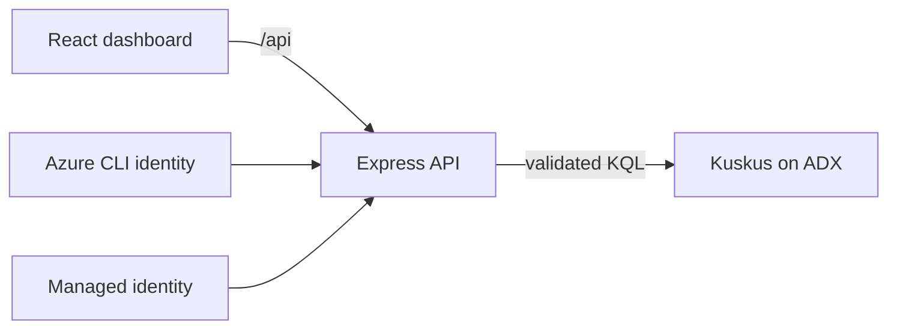

# Kusto Cluster Health

An investigation workbench for Azure Data Explorer and Microsoft Fabric Eventhouse clusters. It combines reusable KQL diagnostics with a responsive React dashboard for compute, cache, storage, query workload, and configuration changes.

The app queries the internal `Kuskus` database through a server-side API. Access tokens and Kusto connectivity never reach the browser.

## Features

- Filter by customer, Fabric capacity, cluster, alteration type, and time range.
- Inspect CPU, cache hit ratio, query failures and latency, disk queue pressure, and top consumers.
- Correlate health signals with Memento cluster and database alterations.
- Run with Azure CLI authentication or managed identity.
- Reuse each file in `queries/` independently.

## Local Setup

Requirements: Node.js 20+, Azure CLI, and query access to `https://kuskushead.westeurope.kusto.windows.net/Kuskus`.

```powershell
az login
npm install
npm run dev:local
```

Open `http://localhost:5173`. Express listens on port 3001 and Vite proxies `/api` to it.

## Configuration

| Variable | Default | Purpose |
| --- | --- | --- |
| `KUSTO_CLUSTER_URL` | `https://kuskushead.westeurope.kusto.windows.net` | ADX query endpoint |
| `KUSTO_DATABASE` | `Kuskus` | Diagnostic database |
| `KUSTO_AUTH_MODE` | `azure-cli` | Set to `managed-identity` when hosted |
| `AZURE_CLIENT_ID` | unset | Optional user-assigned identity client ID |
| `PORT` | `3001` | API port |

Never place credentials in `VITE_` variables because they are browser-visible.

## Architecture



The API validates parameters with Zod, escapes template bindings, selects a time resolution for the requested range, and aggregates in Kusto. Confidential top-query traces are redacted before display.

## Query Catalog

| Query | Purpose |
| --- | --- |
| `clusters.kql` | Customer, capacity, and cluster inventory |
| `metadata.kql` | Selected cluster topology and service metadata |
| `cpu.kql` | Average and P95 engine CPU |
| `memory.kql` | Memory pressure and availability |
| `disk-queue.kql` | Average and P95 storage queue depth |
| `cache.kql` | Hot-cache byte hit ratio |
| `queries.kql` | Query count, failures, and P95 duration |
| `top-queries.kql` | Workloads ranked by total CPU |
| `changes.kql` | Memento alteration history |
| `cluster-diagnostics.kql` | Standalone investigation starter |

## Investigation Guidance

Dashboard thresholds are triage aids, not service limits. Compare every signal with the cluster baseline and incident timeline.

- **CPU:** Sustained high P95 plus concentrated query CPU suggests workload optimization or scaling analysis.
- **Cache:** Low hit ratio can indicate queried ranges outside cache policy, broad scans, or a policy change.
- **Disk queue:** Correlate queue depth with cache misses, ingestion volume, and extent maintenance.
- **Extent merge:** Merge and recycle are normal. Investigate dense windows only when they align with CPU, disk, ingestion, or latency shifts.
- **Retention:** A reduction can trigger cleanup; an increase changes storage footprint. Confirm that the alteration precedes the symptom.

## Commands

| Command | Purpose |
| --- | --- |
| `npm run dev:local` | Start API and dashboard with startup sequencing |
| `npm run build` | Type-check and build the frontend |
| `npm run check:server` | Type-check the Express server |
| `npm run lint` | Run ESLint |
| `npm test` | Run Vitest |
| `npm run build:fabric` | Build the static Rayfin app |

## Fabric and Rayfin Status

The repository retains a Rayfin Universal App structure and produces a Fabric-ready static build. Rayfin preview 1.35 does not expose a supported server-side Functions deployment/runtime path for this secure Kusto API. Static-only deployment would break querying or expose credentials, so it is intentionally not used.

Fabric hosting requires a supported Rayfin server runtime when available, or another Fabric-compatible backend using managed identity and the same `/api/clusters` and `/api/health` contracts. The Express implementation is the reference backend.

## Validation

The live dashboard has been exercised at desktop and mobile widths. Frontend and server TypeScript builds pass without warnings.
